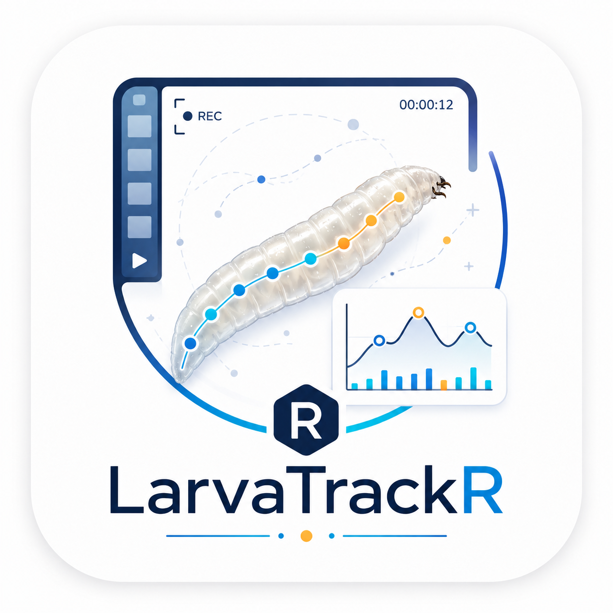

title: "LarvaTrackR"
output: github_document
-----------------------

# LarvaTrackR 

**LarvaTrackR** is an R package for semi-automated larval movement tracking from video files.

It provides tools to extract video frames, select regions of interest, calibrate pixel size, manually select larvae or other moving objects, track their movement across frames, calculate movement metrics, and visualise behavioural outputs such as speed, cumulative distance, displacement, freezing-like behaviour, and companion distance.

## Installation

Install the required packages:

```r
install.packages("remotes")
install.packages("BiocManager")

BiocManager::install("EBImage")
```

Then install **LarvaTrackR** from GitHub:

```r
remotes::install_github("EhsanRz/LarvaTrackR")
```

Load the package:

```r
library(LarvaTrackR)
```

## Main functions

| Function                         | Purpose                                                     |
| -------------------------------- | ----------------------------------------------------------- |
| `read_video_frames()`            | Extract and load video frames                               |
| `plot_frame()`                   | Display a selected video frame                              |
| `select_roi()`                   | Select a region of interest                                 |
| `crop_frames_to_roi()`           | Crop frames to the selected ROI                             |
| `calibrate_scale()`              | Calculate pixel size in mm/pixel                            |
| `select_objects_precise()`       | Manually select larvae or objects to track                  |
| `plot_selected_objects()`        | Display selected objects on a frame                         |
| `track_selected_points()`        | Track selected objects across frames                        |
| `calculate_movement_mm_clean()`  | Calculate cleaned speed, distance, and displacement metrics |
| `calculate_velocity_mm()`        | Calculate frame-to-frame velocity in mm/s                   |
| `plot_tracks_on_frame()`         | Overlay tracks on a video frame                             |
| `plot_tracks_3d()`               | Visualise object tracks in 3D over time                     |
| `plot_total_distance()`          | Plot cumulative movement over time                          |
| `plot_speed_over_time()`         | Plot speed over time                                        |
| `plot_speed_over_time_clean()`   | Plot cleaned speed over time                                |
| `plot_displacement_from_start()` | Plot displacement from the starting position                |
| `add_freezing_status()`          | Detect freezing-like behaviour                              |
| `calculate_companion_distance()` | Calculate distance between tracked objects                  |
| `plot_companion_distance()`      | Plot companion distance over time                           |

## Interactive use

Several functions require manual clicking on plots, including:

* `select_roi()`
* `calibrate_scale()`
* `select_objects_precise()`

These functions should be run interactively in RStudio or another interactive R session. They should not be run during automatic knitting, package checks, or non-interactive workflows.

## Citation

If you use **LarvaTrackR** in your work, please cite the GitHub repository or associated publication if available.

## Author

**Ehsan Razmara**
